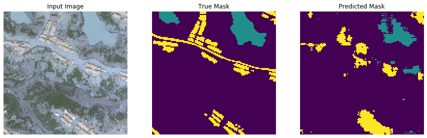
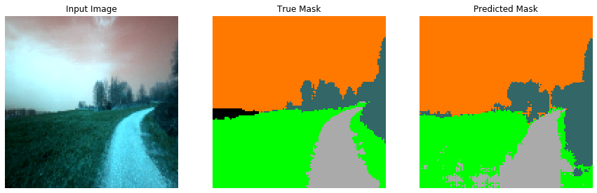

# Image Segmentation Project
A tensorflow auto encoder model that has been trained on two sets of dataset to achieve the image segmentation tasks. The model used was a unet model where the downsampling layers are part of a pretrained model previously trained on the ImageNet dataset and is frozen during training on our dataset. Additional upsampling layers were added to be trained to produce the desired segmentated image. 

## Considition Segmentation
The input images are drone shots of rural areas and the output image is to dstinguish between roads, water, building or none of the above. 

## Forest Segmentation 
The input images are frames of vehicle front camera moving througha forest and the output image should be able to distinguish between road, frass, vegetation, sky or obstacle. This is intended for vehicle navigation purposes. 